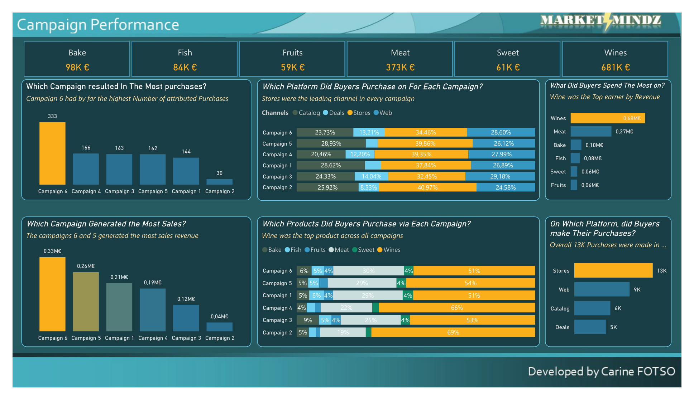
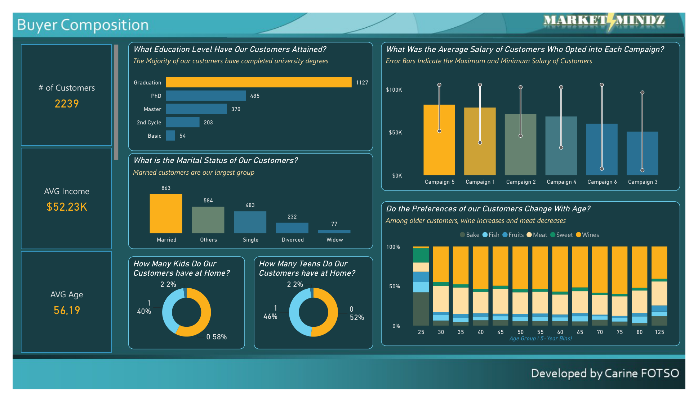
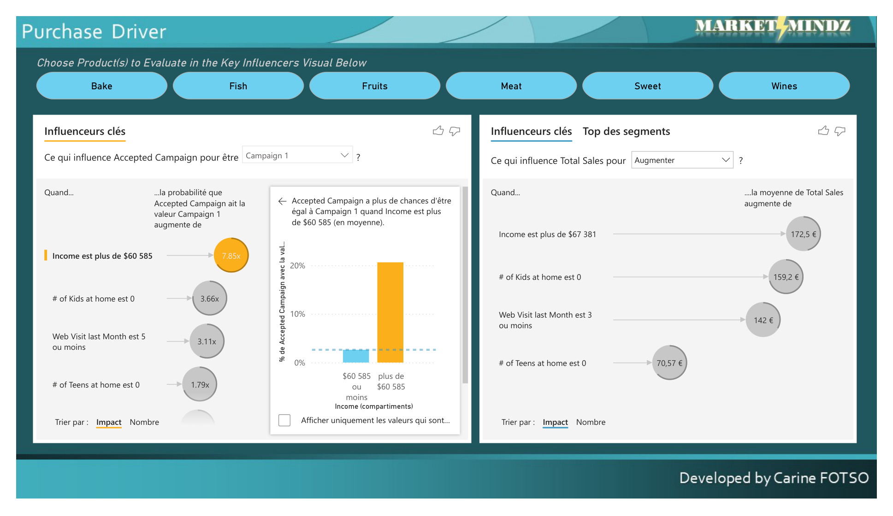

# 📈 MarketMindz — Analyse de campagnes marketing et de clientèle

Rapport Power BI en 4 pages pour un distributeur agroalimentaire : performance des campagnes, contribution des produits, profil de la clientèle et facteurs de décision d'achat.

---

## Contexte

MarketMindz est un cabinet d'études de marché qui accompagne un distributeur de produits alimentaires et de boissons. Le client est une petite structure qui **connaît encore mal son marché et sa clientèle**, et qui vient de transmettre un premier échantillon de données marketing.

Quatre questions posées :

1. Comment se comportent nos **6 campagnes** marketing récentes ?
2. Comment se comportent nos **6 catégories de produits** ?
3. **Qui sont** nos clients ?
4. **Qu'est-ce qui détermine** la performance d'une campagne et la décision d'achat ?

> **Source des données :** jeu de données d'étude de cas *MarketMindz*. 2 239 clients, 33 000 achats, ~1,36 M€ de chiffre d'affaires.

---

## Méthode

| Étape | Détail |
|---|---|
| Préparation | Nettoyage et typage sous Power Query, contrôle du dictionnaire de données |
| Modélisation | Mesures DAX : CA par campagne et par produit, taux d'acceptation, paniers moyens |
| Analyse | Visuel **Influenceurs clés** (analyse automatisée des facteurs) sur l'acceptation de campagne et le chiffre d'affaires |
| Restitution | Rapport 4 pages : contexte, campagnes, clientèle, facteurs |

---

## Résultats

### 1. Une campagne écrase les autres — et une autre est à arrêter

| Campagne | Achats attribués | Chiffre d'affaires |
|---|---|---|
| **Campagne 6** | **333** | **0,33 M€** |
| Campagne 4 | 166 | 0,19 M€ |
| Campagne 3 | 163 | 0,12 M€ |
| Campagne 5 | 162 | 0,26 M€ |
| Campagne 1 | 144 | 0,21 M€ |
| **Campagne 2** | **30** | **0,04 M€** |

La campagne 6 génère **11 fois plus d'achats** et **8 fois plus de revenu** que la campagne 2.

👉 **Implication :** la campagne 6 est le modèle à reproduire ; la campagne 2 ne justifie pas son budget. À noter : la campagne 5 rapporte davantage que la 4 et la 3 avec moins d'achats — son panier moyen est plus élevé, elle touche une clientèle plus aisée.

### 2. Le vin est le produit stratégique

| Produit | Chiffre d'affaires | Part |
|---|---|---|
| **Vins** | **681 K€** | **50 %** |
| Viande | 373 K€ | 28 % |
| Boulangerie | 98 K€ | 7 % |
| Poisson | 84 K€ | 6 % |
| Sucré | 61 K€ | 5 % |
| Fruits | 59 K€ | 4 % |

**Vin et viande représentent 78 % du chiffre d'affaires.** Le vin est en tête dans **les six campagnes**, où il pèse entre 51 % et 69 % des achats.

👉 **Implication :** la stratégie commerciale du client est, dans les faits, une stratégie vin. Les quatre autres catégories pèsent 22 % à elles quatre.

### 3. Le magasin reste le premier canal

| Canal | Achats |
|---|---|
| Magasin | 13 000 |
| Web | 9 000 |
| Catalogue | 6 000 |
| Promotions | 5 000 |

Le web représente déjà 27 % des achats — un canal secondaire mais installé.

### 4. Le profil client

| | |
|---|---|
| Clients | **2 239** |
| Revenu moyen | **52 230 $** |
| **Âge moyen** | **56 ans** |
| Diplômés du supérieur | 50 % (*Graduation*), + 38 % niveau master ou doctorat |
| Mariés | 39 % |
| Sans enfant à la maison | 58 % |

👉 **Implication :** la clientèle est **âgée, diplômée et sans enfant au foyer**. Cela explique la domination du vin — et les données le confirment : *plus la tranche d'âge augmente, plus la part du vin croît et celle de la viande diminue*. Mais un âge moyen de 56 ans pose une question de **renouvellement de la clientèle** que ce jeu de données ne permet pas de traiter.

### 5. Ce qui déclenche réellement l'achat

Le visuel *Influenceurs clés* quantifie les facteurs d'acceptation de la campagne 1 :

| Facteur | Effet sur la probabilité d'acceptation |
|---|---|
| **Revenu supérieur à 60 585 $** | **× 7,85** |
| Aucun enfant à la maison | × 3,66 |
| 5 visites web par mois ou moins | × 3,11 |
| Aucun adolescent à la maison | × 1,79 |
| Marié | × 1,40 |

Et sur le chiffre d'affaires moyen, tous produits confondus : revenu supérieur à 67 381 $ → **+ 172,50 €**, aucun enfant → + 159,20 €, 3 visites web ou moins → + 142 €.

👉 **L'enseignement central du rapport :** le revenu est de très loin le premier facteur, devant tous les critères de foyer. Un ciblage sur le seul critère « revenu > 60 000 $ » multiplierait par près de 8 la probabilité d'acceptation.

⚠️ Le facteur « peu de visites web » est **contre-intuitif** et mérite prudence : il s'agit probablement d'un effet de profil (les gros acheteurs de vin commandent par catalogue ou en magasin, pas sur le web) plutôt que d'un lien de cause à effet. À ne pas traduire en action sans vérification.

---

## Ce que je retiens

Le client pensait avoir six campagnes et six produits à piloter. Les données disent autre chose : **il a une campagne qui fonctionne, un produit qui porte le chiffre d'affaires, et un segment client unique — les foyers aisés sans enfant.** La priorité n'est pas d'optimiser six campagnes, c'est de comprendre pourquoi la campagne 6 fonctionne et de la répliquer.

## Limites

- **Corrélation, pas causalité.** Le visuel *Influenceurs clés* identifie des associations statistiques, pas des relations causales. Seul un test A/B permettrait de trancher.
- **Aucune donnée de coût.** L'analyse porte sur le chiffre d'affaires ; une campagne rentable peut afficher un CA modeste.
- **Pas d'historique temporel** sur les campagnes : impossible de distinguer un effet de saison d'un effet de campagne.
- **Échantillon de 2 239 clients**, sur une seule période.

## Corrections apportées — septembre 2026

Rapport repris deux ans après sa première version, après relecture complète de l'export PDF.

- ✅ **Indicateur *# of Customers*** : il affichait `2,239K`, soit 2,2 millions de clients, alors que le total réel est de **2 239**. Erreur de format de la mesure, corrigée. *(Contrôle : les barres du graphique Éducation totalisent bien 2 239.)*
- ✅ **Fautes corrigées dans les titres** : *Custaomers*, *complited*, *Statut*, *Opeted*, *Macimun*, *ofour*, *od customers*, *Wth Age*, *resuletd*, *recents*, *purchased*, *Changed With Age*, *elders customers*.
- ✅ **Page 2** : *Campagin* → *Campaign*, *accross* → *across*, légende *Canals* → *Channels*. Le sous-titre du graphique des canaux parlait du vin ; il décrit maintenant ce que le graphique montre.
- ✅ **Page 4** : le segment de produits était resté sélectionné à l'enregistrement. Les facteurs du chiffre d'affaires étaient donc calculés sur une partie des produits seulement, sans le vin. Segment vidé, chiffres relus sur l'ensemble des produits.

### Une précision sur la page 4

Les libellés de la page 4 (*Influenceurs clés*, *Ce qui influence*, *Trier par*) s'affichent en français alors que le reste du rapport est en anglais. **Ce n'est pas un oubli de saisie** : ces textes sont générés par le visuel natif **Influenceurs clés**, dont l'interface suit la langue d'affichage de Power BI Desktop. Ils ne sont pas éditables visuel par visuel.

Pour uniformiser, il faut basculer la langue de l'application (*Fichier → Options → Paramètres régionaux*) puis réexporter — ce qui change l'interface de tous les visuels natifs à la fois.

> 💡 **Ce que je retiens de cette relecture.** Une mesure mal formatée affichait un chiffre **mille fois trop grand**, sans qu'aucune alerte ne se déclenche et sans que personne ne le remarque pendant deux ans. Le contrôle qui l'a révélée est pourtant simple : additionner les barres d'un graphique et comparer au total annoncé. C'est devenu un réflexe systématique.

---

## Explorer le projet

| Fichier | Contenu |
|---|---|
| [`Market-Analysis.pbix`](Market-Analysis.pbix) | Rapport Power BI, interactif |
| [`Market-Analysis.pdf`](Market-Analysis.pdf) | Export PDF des 4 pages |
| [`Data/`](Data/) | Jeu de données et dictionnaire |
| [`Images/`](Images/) | Captures des 4 pages du rapport |
| [`Design/`](Design/) | Gabarits de fond utilisés pour la mise en page |

**Outils :** Power BI Desktop · Power Query · DAX

---

👤 **Carine FOTSO** — Data Analyst
[LinkedIn](https://www.linkedin.com/in/carine-fotso-783164151) · [GitHub](https://github.com/krinf15)
